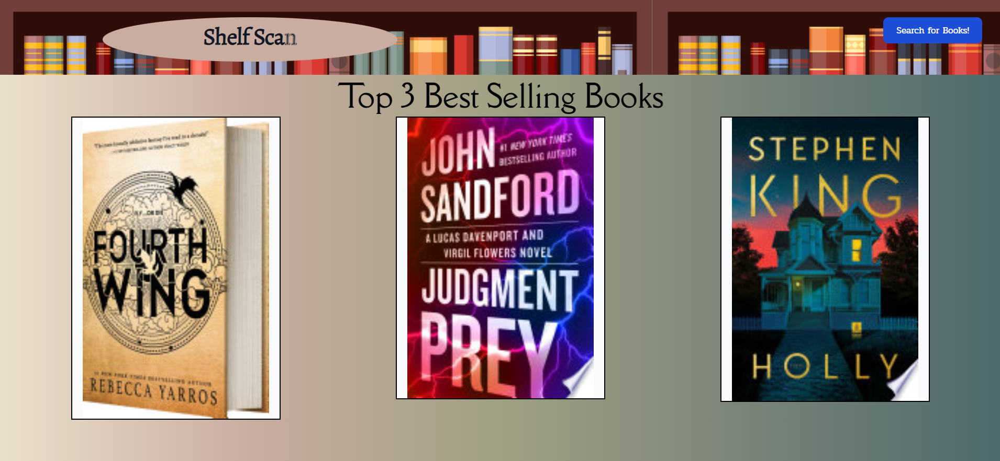
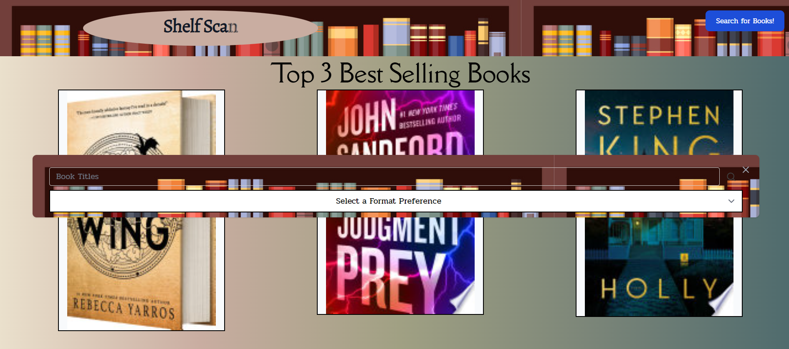
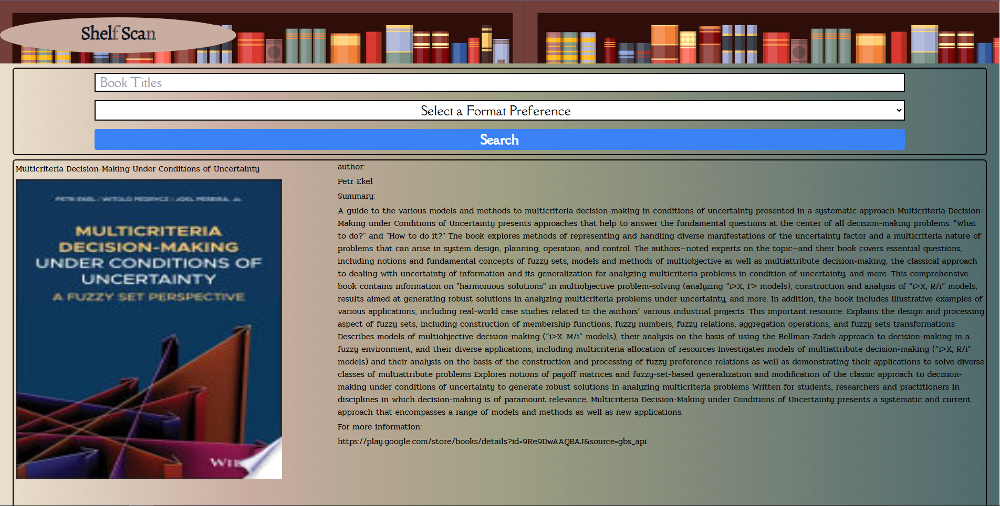

# BootCamp-Project1

Shelf Scan!

## Description:

We developed a webpage that would allow us to use server API's to display information of our choosing. Said webpage use the google and new york times book APIs to seach and conpile information on books. We were challenged by the traversal of the API, but after some time and effort we were able to understand and intirgate it with efficency. We also dived head first into the tailwind CSS framework and were able to successfully apply it to html.

## Usage

This Webpage starts off with a header with title and search button, while the body consists of 3 popular books. Once the search button is click though a modal will appear with the a search bar and criteria selector. Once the search button is click it will save your seach criteria and direct you to our results page in which mutiple options of books and their information is available. Also if you find the information lacking there is a link with each article taking you to a external source with additional information on the book.

## License:

This project is licensed under the MIT-LICENSE.txt you can view the license in the LICENSE file inside the repository

## Credits:

https://medium.com/free-code-camp/build-a-best-sellers-list-with-new-york-times-google-books-api-46201c30aec7#:~:text=We%20also%20need%20to%20see,API%20key%20to%20get%20started

https://v1.tailwindcss.com/components/buttons

https://coolors.co/eae0cc-c9ada1-a0a083-798478-4d6a6d

https://jsonformatter.curiousconcept.com/#

https://developers.google.com/books/docs/overview

https://www.w3.org/

### github repository link & deployed page: 

https://github.com/KaiDoll/shelfscan
https://kaidoll.github.io/shelfscan/

## github contributers: 
@KaiDoll
@Apollolvl
@B-R-Ls

contributers socials:

